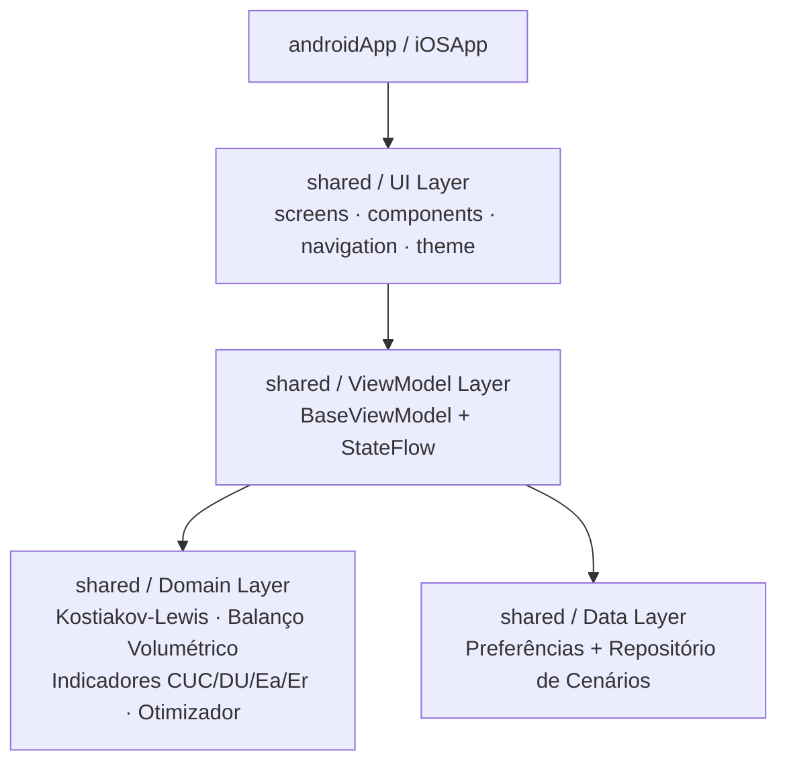

xx<p align="center">


</p>

# IrrigaSIM 💧

### Ferramenta Multiplataforma para Simulação e Ensino de Irrigação por Superfície

[](https://kotlinlang.org/)
[](https://www.jetbrains.com/lp/compose-multiplatform/)
[](#)
[](#)

O **IrrigaSIM** é um aplicativo mobile multiplataforma (Android e iOS) desenvolvido em **Kotlin Multiplatform (KMP)** e **Compose Multiplatform**, voltado à simulação didática e dimensionamento hidráulico de sistemas de **irrigação por superfície** (Sulcos, Faixas e Inundação/Bacias).

Desenvolvido no âmbito de um **projeto de pesquisa (UFLA/DEG)**, o projeto oferece a estudantes e professores de Agronomia e Engenharia Agrícola uma ferramenta interativa, gratuita e offline-first para visualizar, calcular e compreender os fenômenos de avanço, infiltração e uniformidade da água no campo.

---

## 📌 Sumário

- [Recursos Principais](#-recursos-principais)
- [Métodos de Irrigação Suportados](#-métodos-de-irrigação-suportados)
- [Fundamentação Matemática](#-fundamentação-matemática)
- [Arquitetura & Tecnologias](#-arquitetura--tecnologias)
- [Estrutura do Projeto](#-estrutura-do-projeto)
- [Como Executar e Compilar](#-como-executar-e-compilar)
- [Sincronização Git](#-sincronização-git)
- [Licença](#-licença)

---

## 🚀 Recursos Principais

- 🌾 **3 Métodos de Irrigação**: Sulcos (seção trapezoidal), Faixas (_Border_) e Inundação/Bacia (_Basin_).
- 🧙 **Wizard Didático em 4 Etapas**: guia interativo no primeiro acesso — método → solo & requerimento da cultura (presets de solo) → geometria & declividade → manejo hidráulico.
- 📈 **Gráficos Descritivos Nativos em Canvas**:
  - **Balanço Hídrico Volumétrico**: Gráfico Donut (% Aproveitado, Percolação Profunda e Escoamento Superficial).
  - **Curva de Avanço da Água**: Tempo $\times$ Distância ($t_a$).
  - **Perfil Longitudinal Infiltrado**: Lâmina infiltrada $\times$ Comprimento do terreno com linha de referência da lâmina requerida ($LN$).
- 🧮 **Indicadores de Desempenho Completos**:
  - **CUC** (_Christiansen Uniformity Coefficient_)
  - **DU** (_Distribution Uniformity_ / Quarto Inferior)
  - **Ea** (Eficiência de Aplicação) & **Er** (Eficiência de Requerimento)
- 💧 **Otimizador de Vazão** (faixas): recomendação de vazão dentro dos limites não erosivos e do requerimento de lâmina.
- 🗂️ **Histórico de Cenários Salvos**: reabra resultados anteriores e exclua cenários; comparação lado a lado (máx. 2) prevista na especificação do produto.
- ♿ **Acessibilidade Persistida**: tema claro/escuro, tamanho de fonte, alto contraste, negrito, espaçamento de texto, redução de animações e modo leitor de tela — salvos por plataforma (SharedPreferences / NSUserDefaults).
- 🔗 **Navegação Type-Safe + Deep Linking**: pilha manual com transições animadas, botão voltar do sistema, pager sincronizado com a bottom bar e esquema `irrigasim://` para abrir telas específicas.
- 🔒 **Autenticação & Offline-First**: e-mail/senha e Google via Firebase Auth (Android); cálculos 100% offline para uso em campo.

---

## 📐 Métodos de Irrigação Suportados

| Método                  | Aplicação Típica                          | Geometria / Característica                                                           |
| ----------------------- | ----------------------------------------- | ------------------------------------------------------------------------------------ |
| **Sulcos (_Furrow_)**   | Culturas em fileira (Milho, Feijão, Cana) | Seção trapezoidal ($b$, $m$), vazão não erosiva $Q_{máx}$, rugosidade de Manning $n$ |
| **Faixa (_Border_)**    | Pastagens, Cereais de inverno             | Lâmina plana contínua em declive controlado ($S_0$)                                  |
| **Inundação (_Basin_)** | Arroz irrigado, Talhões nivelados         | Bacias niveladas com tempo de enchimento e corte ótimo $t_c$                         |

---

## 🧮 Fundamentação Matemática

### 1. Modelo de Infiltração (Kostiakov-Lewis)

A lâmina infiltrada acumulada $Z(\tau)$ em mm em função do tempo de oportunidade $\tau$ (horas) é dada por:

$$Z(\tau) = k \cdot \tau^a + VIB \cdot \tau$$

Onde:

- $k$: Coeficiente empírico de Kostiakov ($\text{mm/h}^a$)
- $a$: Expoente de infiltração ($0 < a < 1$)
- $VIB$: Taxa de infiltração básica ($\text{mm/h}$)

### 2. Uniformidade de Distribuição (CUC e DU)

- **CUC (Christiansen)**:
  $$CUC = \left( 1 - \frac{\sum |Z_i - \bar{Z}|}{n \cdot \bar{Z}} \right) \times 100$$

- **DU (Distribution Uniformity)**:
  $$DU = \left( \frac{\bar{Z}_{qi}}{\bar{Z}} \right) \times 100$$
  _(onde $\bar{Z}_{qi}$ é a média das 25% menores lâminas infiltradas).\_

### 3. Eficiências & Balanço Volumétrico

- **Eficiência de Aplicação ($E_a$)**:
  $$E_a = \frac{\text{Lâmina armazenada na zona radicular}}{\text{Lâmina total aplicada}} \times 100$$

---

## 🏗️ Arquitetura & Tecnologias

O IrrigaSIM adota a arquitetura **Clean Architecture + MVVM**, com UI, estado e domínio compartilhados:



### Stack Tecnológica

- **Linguagem**: Kotlin 1.9.20
- **Multiplataforma**: Compose Multiplatform 1.5.10 (Android & iOS), Android Gradle Plugin 8.2.2
- **Desenho de Gráficos**: Compose Canvas (100% nativo KMP, sem bibliotecas externas)
- **Autenticação**: Firebase Auth — Android (`firebase-auth-ktx` via BOM) · iOS (CocoaPods `Firebase/Auth`)
- **Persistência local**: SharedPreferences (Android) / NSUserDefaults (iOS)

---

## 📁 Estrutura do Projeto

```
IrrigaSim/
├── androidApp/                   # App Android (MainActivity, Firebase Auth)
├── iosApp/                       # App iOS (SwiftUI + ComposeUIViewController, CocoaPods)
├── shared/                       # Módulo Kotlin Multiplatform compartilhado
│   └── src/
│       ├── commonMain/kotlin/com/irrigasim/
│       │   ├── domain/
│       │   │   ├── Models.kt              # MetodoIrrigacao, Parametros, Resultado,
│       │   │   │                          # Simulacao.executar() (dispatcher central)
│       │   │   ├── infiltracao/           # KostiakovLewis.kt
│       │   │   ├── sulcos/                # SimulacaoSulcos.kt, ParametrosSulco.kt
│       │   │   ├── faixas/                # SimulacaoFaixas.kt, BalancoVolumetrico.kt,
│       │   │   │                          # OtimizadorVazao.kt, VazaoLimites.kt
│       │   │   ├── inundacao/             # SimulacaoInundacao.kt
│       │   │   └── indicadores/           # IndicadoresDesempenho.kt (CUC, DU, Ea, Er)
│       │   ├── data/
│       │   │   ├── PreferenciasApp.kt     # expect: preferências persistidas por plataforma
│       │   │   └── RepositorioSimulacoesFactory.kt  # expect: CRUD de cenários salvos
│       │   └── ui/
│       │       ├── App.kt                 # Entrypoint Compose + navegação + pager
│       │       ├── screens/               # Metodo, Wizard, Parametros, Resultado,
│       │       │   │                      # Historico, Perfil
│       │       │   └── auth/              # LoginScreen, CadastroScreen
│       │       ├── components/            # KpiCard, Campo, CustomChip, CustomProgressBar,
│       │       │                          # GraficoAvanco, GraficoBalancoHidrico,
│       │       │                          # GraficoLaminaLongitudinal
│       │       ├── navigation/            # ScreenRoute, AppNavigation, DeepLink, BackHandler
│       │       ├── theme/                 # Theme.kt (acessibilidade), Icons.kt
│       │       └── viewmodel/             # BaseViewModel + 6 ViewModels (StateFlow)
│       ├── androidMain/                   # SharedPreferences, OnBackPressedDispatcher
│       ├── iosMain/                       # NSUserDefaults, ComposeUIViewController
│       └── commonTest/                    # Domínio, ViewModels, navegação, tema
└── docs/                         # Documentação técnica e ADRs
```

---

## ⚡ Como Executar e Compilar

### Pré-requisitos

- **JDK 17** ou superior
- **Android Studio Jellyfish** (ou superior) com SDK Android 34+
- **Xcode 15+** (apenas para compilação iOS em macOS)

### 1. Gerar o APK Android (Debug)

Para gerar o executável APK diretamente sem abrir o Android Studio:

```bash
./gradlew :androidApp:assembleDebug
```

O arquivo APK gerado ficará em:
`androidApp/build/outputs/apk/debug/androidApp-debug.apk`

### 2. Instalar e Rodar no Celular/Emulador via USB

```bash
./gradlew :androidApp:installDebug
```

### 3. Executar Testes Unitários

```bash
./gradlew :shared:check
```

---

## 🔄 Sincronização Git

O repositório está versionado e sincronizado com o remote oficial:

```bash
# Repositório Remote
git remote -v
# origin  git@github.com:lowgue/IrrigaSim.git (fetch)
# origin  git@github.com:lowgue/IrrigaSim.git (push)

# Clonar o repositório
git clone git@github.com:lowgue/IrrigaSim.git
```

---

## 📄 Licença

Desenvolvido para fins de pesquisa científica e ensino acadêmico no âmbito do Departamento de Engenharia da Universidade Federal de Lavras (**UFLA/DEG**).
