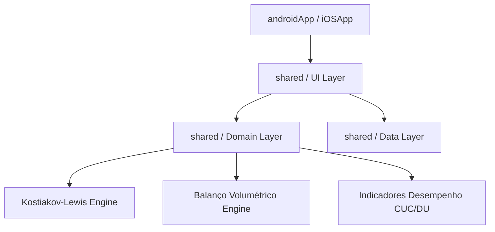

<p align="center">
  
</p>

# IrrigaSIM 💧
### Ferramenta Multiplataforma para Simulação e Ensino de Irrigação por Superfície

[](https://kotlinlang.org/)
[](https://www.jetbrains.com/lp/compose-multiplatform/)
[](#)
[](#)

O **IrrigaSIM** é um aplicativo mobile multiplataforma (Android e iOS) desenvolvido em **Kotlin Multiplatform (KMP)** e **Compose Multiplatform**, voltado à simulação didática e dimensionamento hidráulico de sistemas de **irrigação por superfície** (Sulcos, Faixas e Inundação/Bacias).

Desenvolvido no âmbito de um **projeto de pesquisa (UFLA/DEG)**, o projeto oferece a estudantes e professores de Agronomia e Engenharia Agrícola uma ferramenta interativa, gratuita e offline-first para visualizar, calcular e compreender os fenômenos de avanço, infiltração e uniformidade da água no campo.

---

## 📌 Sumário
- [Recursos Principais](#-recursos-principais)
- [Métodos de Irrigação Suportados](#-métodos-de-irrigação-suportados)
- [Fundamentação Matemática](#-fundamentação-matemática)
- [Arquitetura & Tecnologias](#-arquitetura--tecnologias)
- [Estrutura do Projeto](#-estrutura-do-projeto)
- [Como Executar e Compilar](#-como-executar-e-compilar)
- [Sincronização Git](#-sincronização-git)
- [Licença](#-licença)

---

## 🚀 Recursos Principais

- 🌾 **3 Métodos de Irrigação**: Sulcos (seção trapezoidal), Faixas (*Border*) e Inundação/Bacia (*Basin*).
- 📈 **Gráficos Descritivos Nativos em Canvas**:
  - **Balanço Hídrico Volumétrico**: Gráfico Donut (% Aproveitado, Percolação Profunda e Escoamento Superficial).
  - **Curva de Avanço da Água**: Tempo $\times$ Distância ($t_a$).
  - **Perfil Longitudinal Infiltrado**: Lâmina infiltrada $\times$ Comprimento do terreno com linha de referência da lâmina requerida ($LN$).
- 🧮 **Indicadores de Desempenho Completos**:
  - **CUC** (*Christiansen Uniformity Coefficient*)
  - **DU** (*Distribution Uniformity* / Quarto Inferior)
  - **Ea** (Eficiência de Aplicação) & **Er** (Eficiência de Requerimento)
- 🔒 **Autenticação & Offline-First**: Suporte a e-mail/senha, Google Auth (Firebase) e execução local 100% offline para uso em campo.

---

## 📐 Métodos de Irrigação Suportados

| Método | Aplicação Típica | Geometria / Característica |
|---|---|---|
| **Sulcos (*Furrow*)** | Culturas em fileira (Milho, Feijão, Cana) | Seção trapezoidal ($b$, $m$), vazão não erosiva $Q_{máx}$, rugosidade de Manning $n$ |
| **Faixa (*Border*)** | Pastagens, Cereais de inverno | Lâmina plana contínua em declive controlado ($S_0$) |
| **Inundação (*Basin*)** | Arroz irrigado, Talhões nivelados | Bacias niveladas com tempo de enchimento e corte ótimo $t_c$ |

---

## 🧮 Fundamentação Matemática

### 1. Modelo de Infiltração (Kostiakov-Lewis)
A lâmina infiltrada acumulada $Z(\tau)$ em mm em função do tempo de oportunidade $\tau$ (horas) é dada por:

$$Z(\tau) = k \cdot \tau^a + VIB \cdot \tau$$

Onde:
- $k$: Coeficiente empírico de Kostiakov ($\text{mm/h}^a$)
- $a$: Expoente de infiltração ($0 < a < 1$)
- $VIB$: Taxa de infiltração básica ($\text{mm/h}$)

### 2. Uniformidade de Distribuição (CUC e DU)
- **CUC (Christiansen)**:
  $$CUC = \left( 1 - \frac{\sum |Z_i - \bar{Z}|}{n \cdot \bar{Z}} \right) \times 100$$

- **DU (Distribution Uniformity)**:
  $$DU = \left( \frac{\bar{Z}_{qi}}{\bar{Z}} \right) \times 100$$
  *(onde $\bar{Z}_{qi}$ é a média das 25% menores lâminas infiltradas).*

### 3. Eficiências & Balanço Volumétrico
- **Eficiência de Aplicação ($E_a$)**:
  $$E_a = \frac{\text{Lâmina armazenada na zona radicular}}{\text{Lâmina total aplicada}} \times 100$$

---

## 🏗️ Arquitetura & Tecnologias

O IrrigaSIM adota a arquitetura **Clean Architecture + KMP Modular**:



### Stack Tecnológica
- **Linguagem**: Kotlin 2.0.0
- **Multiplataforma**: Compose Multiplatform 1.6.11 (Android & iOS)
- **Desenho de Gráficos**: Compose Canvas (100% nativo KMP)
- **Backend/Nuvem**: Firebase Auth & Firestore Multiplatform

---

## 📁 Estrutura do Projeto

```
IrrigaSim/
├── androidApp/                   # App Android nativo (Entrypoint, MainActivity, Manifest)
├── iosApp/                       # App iOS (SwiftUI + ComposeUIViewController)
├── shared/                       # Módulo Kotlin Multiplatform compartilhado
│   └── src/
│       ├── commonMain/
│       │   └── kotlin/com/irrigasim/
│       │       ├── domain/
│       │       │   ├── infiltracao/      # KostiakovLewis.kt
│       │       │   ├── faixas/           # SimulacaoFaixas.kt, BalancoVolumetrico.kt
│       │       │   ├── sulcos/           # SimulacaoSulcos.kt, ParametrosSulco.kt
│       │       │   ├── inundacao/        # SimulacaoInundacao.kt, ParametrosInundacao.kt
│       │       │   └── indicadores/      # IndicadoresDesempenho.kt (CUC, DU, Ea, Er)
│       │       └── ui/
│       │           ├── components/       # GraficoAvanco, GraficoLamina, GraficoBalanco
│       │           ├── App.kt            # Entrypoint Compose
│       │           └── Screens.kt        # Telas de Metodo, Parametros e Resultados
│       ├── androidMain/                  # Implementações específicas Android
│       └── iosMain/                      # Implementações específicas iOS
└── docs/                         # Documentação técnica e ADRs
```

---

## ⚡ Como Executar e Compilar

### Pré-requisitos
- **JDK 17** ou superior
- **Android Studio Jellyfish** (ou superior) com SDK Android 34+
- **Xcode 15+** (apenas para compilação iOS em macOS)

### 1. Gerar o APK Android (Debug)
Para gerar o executável APK diretamente sem abrir o Android Studio:

```bash
./gradlew :androidApp:assembleDebug
```
O arquivo APK gerado ficará em:
`androidApp/build/outputs/apk/debug/androidApp-debug.apk`

### 2. Instalar e Rodar no Celular/Emulador via USB

```bash
./gradlew :androidApp:installDebug
```

### 3. Executar Testes Unitários

```bash
./gradlew :shared:check
```

---

## 🔄 Sincronização Git

O repositório está versionado e sincronizado com o remote oficial:

```bash
# Repositório Remote
git remote -v
# origin  git@github.com:lowgue/IrrigaSim.git (fetch)
# origin  git@github.com:lowgue/IrrigaSim.git (push)

# Clonar o repositório
git clone git@github.com:lowgue/IrrigaSim.git
```

---

## 📄 Licença

Desenvolvido para fins de pesquisa científica e ensino acadêmico no âmbito do Departamento de Engenharia da Universidade Federal de Lavras (**UFLA/DEG**).
